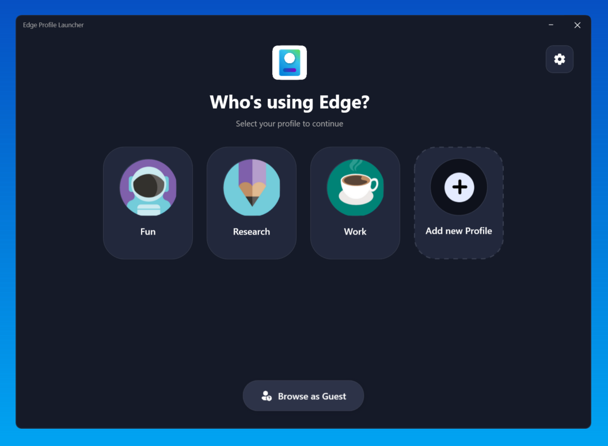
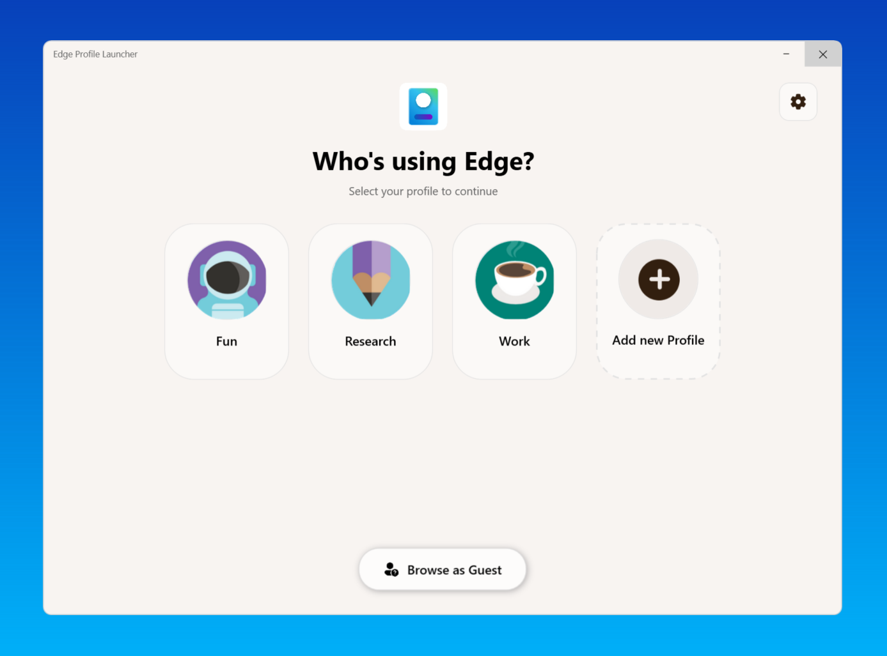
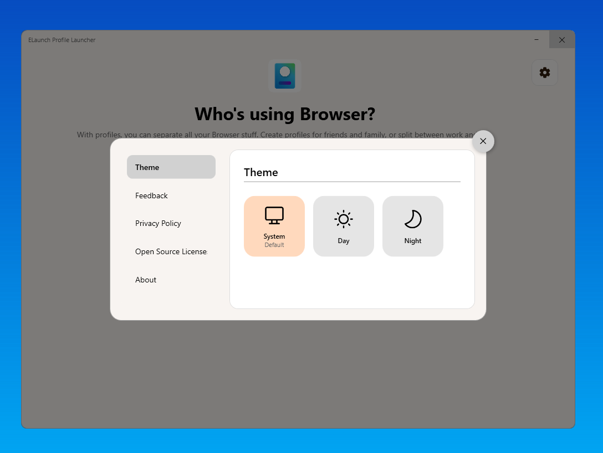
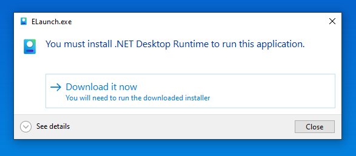
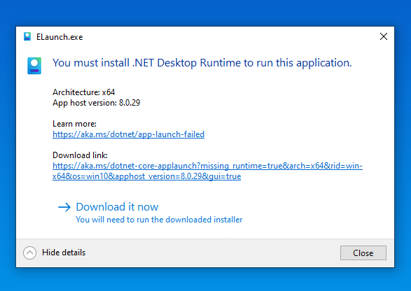
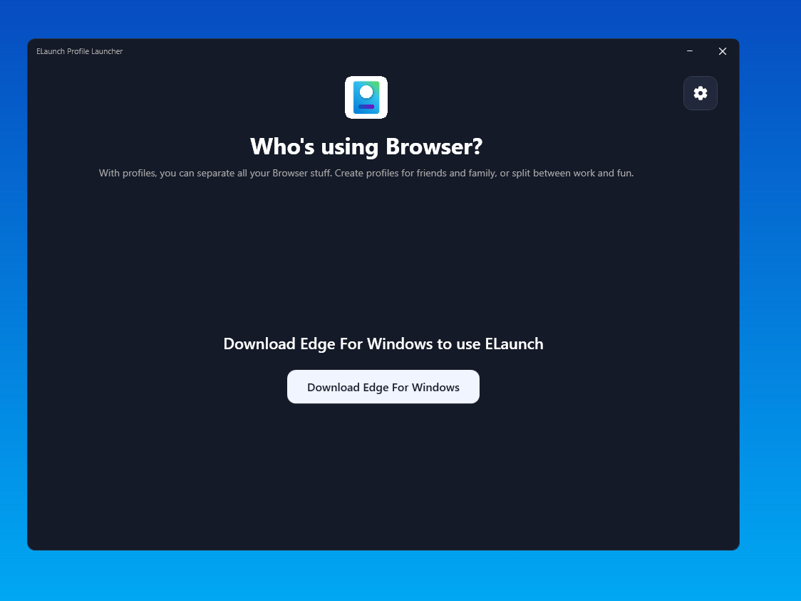

# ELaunch Screenshots

Explore ELaunch's user interface across different themes, settings options, and built-in fallback prompts.

---

## Main Application Interface

| Dark Theme | Light Theme |
| :---: | :---: |
|  |  |

---

## Settings & Configuration

### Application Settings

---

## Fallbacks & Dependency Prompts

### .NET Desktop Runtime Requirement
*Prompt displayed when the target system lacks the required .NET runtime (Framework-Dependent builds).*

| Standard Prompt | Detailed View |
| :---: | :---: |
|  |  |

### Microsoft Edge Missing Prompt
*Fallback screen shown when Microsoft Edge is not detected on the machine.*

---

[← Back to Main README](../../README.md)
